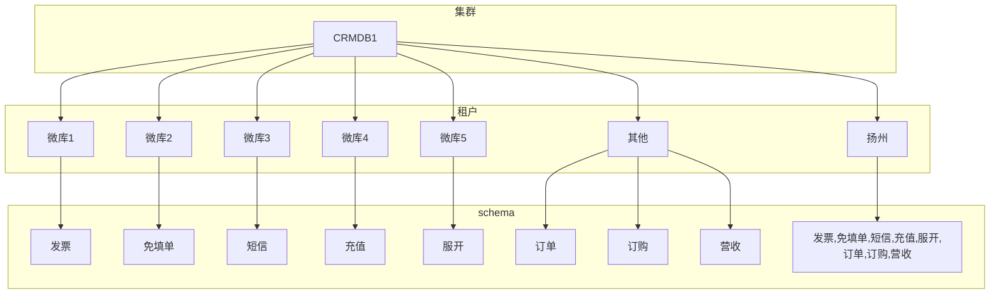

# CRM系统库拆分原则

​																																				                                   by 宁樾

## 基础概念

OceanBase 数据库通过 OceanBase 集群来进行管理。一个 OceanBase 集群由多个 OBServer 节点组成，每个 OBServer 节点属于一个 Zone。一般情况下，各个 Zone 内的机器配置与数量保持一致，多台 OBServer 作为资源组成各个业务所需的资源池。管理员可以根据业务情况，将资源再划分成不同大小的资源池分配给租户使用，一般建议高性能要求的业务分配大资源池，低性能要求的业务分配小资源池。

OceanBase 数据库基础概念之间的关系如下图所示：

 

## 整体架构

- CRMDB1库共使用一个集群

- 集群内拆分7个租户

  - 一套1-1-1架构的租户用来存储扬州库的所有数据

  - 5个小租户用来存储拆分的5个微库套件数据，每一个套件内包含南通，泰州，盐城三地的数据，每2个小租户共用一台服务器

  - 一套2-2-2的大租户用来存储其他的三个套件（订单，订购，营收），使用分区迁移技术将不同的schema迁移到不同的服务器上

## 分布示意图

- 共使用2种技术进行了表的聚合

  - 使用小租户进行聚合
    - 小租户聚合的好处是运维难度低，尤其是小租户的时候，所有的表的分布都在一台机器上，不需要再考虑负载均衡
    - 带来的代价是如果跨租户的事务，需要使用中间件或者使用dblink
  - 使用schema进行手工聚合
    - 天然支持跨schema的事务
    - 运维难度高，需要对每个分区都进行存储分布判断，当进行了类似truncate，重建表等操作后，需要再进行一次分区迁移
    - 扩容后，仍然存在分布式事务的可能性，需要更细力度的表的分布判断，整体难度很大
    - 必须关闭负载均衡的能力，可能造成热点问题

## 扩容带来的分布问题和TableGroup

  - 当未来整个江苏地市全部迁移至集群的时候的扩容：

    - 微库可以直接使用一台Server
    - 但是订单，订购，营收库可能需要更多的服务器，比如，该租户扩展到4台服务器的时候，如何进行迁移，则需要手工进行表的判断，整体难度非常高
    - 
  - OceanBase本身还提供一种基于tablegroup的聚合能力：

      - 基于tablegroup的聚合带来了业务的挑战，需要对业务表进行分析，需要将所有需要聚合的表的分区设置成完全一致，这时候OceanBase会将每张表的同一个值的分区分配到同一台机器上
- 这种聚合带来的好处就是完全不受扩容的影响
  - 当服务器扩容之后，OceanBase的自动负载均衡的能力会自动将所有的分区按照规则打散到所有的服务器上，不需要人工进行干预，运维难度极大降低
- 基于tablegroup的自动负载，也能极大的避免热点问题的存在
  - 由于单台服务器的数据量的减少，同事整体负载被更小力度的打散到更多的服务器上，也能带来扩容后的性能的不下降，以及整体吞吐量的增加
  - 示意图如下： 