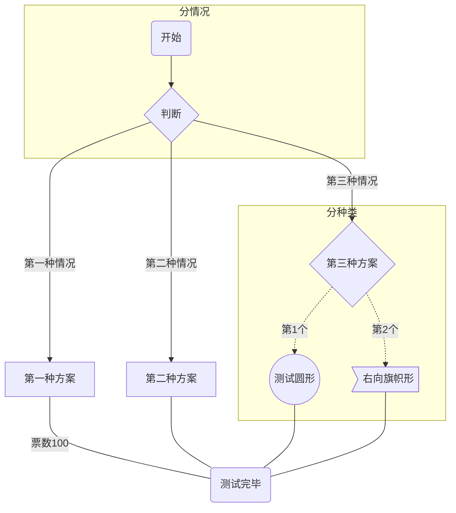
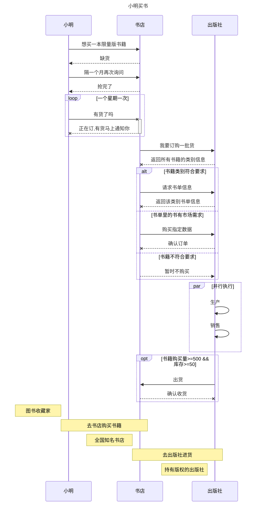
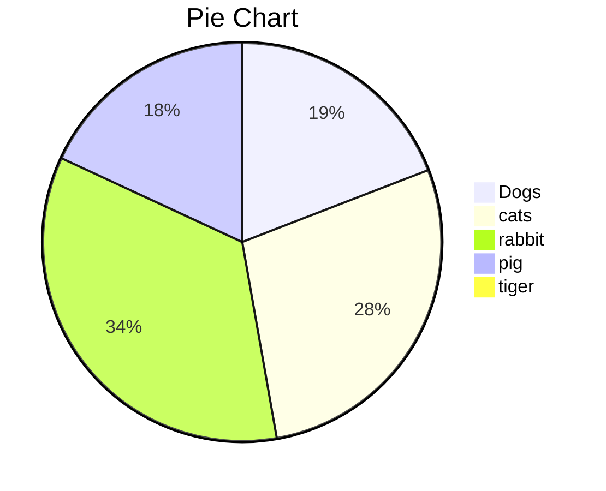
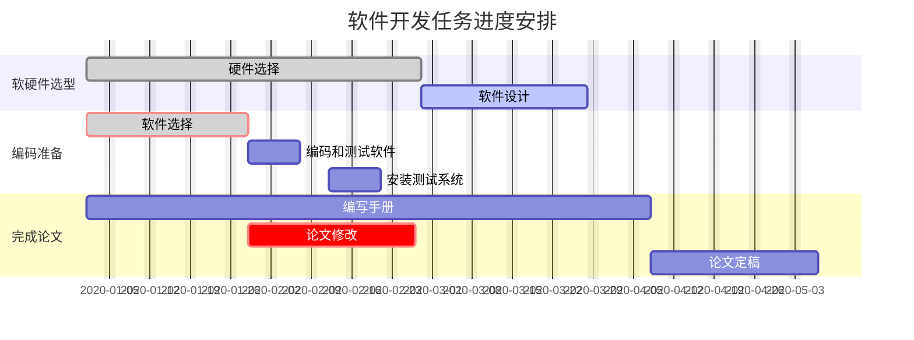

# MarkDown画图(实例讲解) —— 流程图、序列图、饼图、甘特图

写这篇文章的目的主要是**学习markdown画图**。目前支持画图的MarkDown工具只有**Typora和有道云笔记**

**ProcessOn VS MarkDown。**虽然ProcessOn也能做这件事情，但是每次使用都要以图片的形式进行编辑，不便于微调。在不同应用之间前切换也比较麻烦

**我的学习方法**。我会想出一个综合性的场景，然后把所有的知识点融入到一张图里去。这样做的好处是，回忆的时候只用回忆一张图就够了，提高回忆效率。

[语法参见官网](https://links.jianshu.com/go?to=https%3A%2F%2Fmermaid-js.github.io%2Fmermaid%2F%23%2F)

**文章目录如下：**

- 流程图代码如下：
- 代码说明：
- typora中效果图如下：
- 序列图代码如下：
- 代码说明:
- typora中效果图如下：
- 饼图代码如下：
- typora中效果图如下：
- 甘特图代码说明:
- 代码如下：
- typora中展示效果如下：

## 流程图

#### 代码如下：



#### 代码说明：

| 字母表示 | 含义     |
| -------- | -------- |
| TB       | 从上到下 |
| BT       | 从下到上 |
| LR       | 从左到右 |
| RL       | 从右到左 |

| 表述       | 说明         | 含义                                               |
| ---------- | ------------ | -------------------------------------------------- |
| id[文字]   | 矩形节点     | 表示过程                                           |
| id(文字)   | 圆角矩形节点 | 表示开始与结束                                     |
| id((文字)) | 圆形节点     | 表示连接。为避免流程过长或有交叉，可将流程切开成对 |
| id{文字}   | 菱形节点     | 表示判断、决策                                     |
| id>文字 ]  | 右向旗帜节点 |                                                    |

> 1. T、B、L、T分别是Top/Bottom/Left/Right的缩写
> 2. id为节点的唯一标识，类似于变量。括号内为节点要显示的文字
> 3. 单向箭头为流程进行方向。支持虚线与实线，有箭头与无箭头、有文字与无文字。分别是---、-.-、 -->、-.->、--文字-->、-.文字.->、--文字---、-.文字.-
> 4. 支持子图。如代码、效果图所示。

## 序列图

序列图共有5个部分，分别是：**参与者、消息线、循环、选择、可选、并行、注解**。我们来模拟一个综合场景，如下图所示:

#### 代码如下：



#### 代码说明:

1. 消息线

| 类型 | 描述                             |
| ---- | -------------------------------- |
| ->   | 无箭头的实线                     |
| -->  | 无箭头的虚线                     |
| ->>  | 有箭头的实线(主动发出消息)       |
| -->> | 有箭头的虚线(响应)               |
| -x   | 末端为X的实线(主动发出异步消息)  |
| --x  | 有箭头的实线(以异步形式响应消息) |

> alt 可以理解为可替代的方案，可能的情况
>
> opt可以理解为一个if语句，满足条件下执行的操作

## 饼图

#### 代码如下：



## 甘特图

这是我用Process做的，我们就以张图为例，用MarkDown画一张甘特图吧。

顺便对比一下这两种方式，看看哪个展示效果好一点


效果图

#### 代码说明：

```mermaid
gantt
 dateFormat  YYYY-MM-DD    //底部的时间格式
 title     Adding GANTT diagram functionality to mermaid   //甘特图名称
 excludes   weekends               //周末有休息

 section A         //可以理解为一个功能模块
 task1        :done,des1, 2014-01-06,2014-01-08   //可以理解为这个功能模块的各项进度安排
 task2        :active,des2, 2014-01-09, 3d      //以下参数都是合法的
 task3        :des3, after des2, 5d          //我们等一下每个都试一下
 task4        :crit, done, 2014-01-06,24h
 task5        :crit, done, after des1, 2d
 task6        :crit, active, 3d
 task7        :crit, 5d
 task8        :2d
 task9        :1d
 ...         :[参数1:crit,可不填],[参数2:active,done,可不填表示待完成],[参数3:小名],
 [参数4:开始时间],[参数5:结束时间]
 section B
 section C 
 ...
```

这里要注意的是，时间的表示有多种，如上，

可以是

- 2014-01-06,2014-01-08
- 2014-01-09, 3d
- after des2, 5d
- 5d
- 状态默认是待完成，建议给每个任务desc

#### 代码如下：


